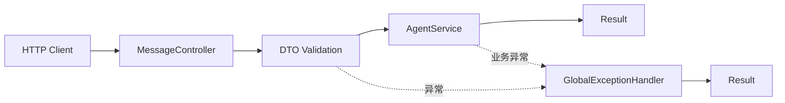

# ReminderCat

ReminderCat 是一个面向微信场景的 AI 提醒助手后端。用户可以发送自然语言提醒，例如“明天下午 3 点提醒我开会”，系统负责接收、校验并处理消息。

当前版本聚焦于可运行的后端基础闭环，暂未接入微信、真实数据库、Redis 服务或真实 LLM API。

## 技术栈

- Java 21
- Spring Boot 4.x
- Maven
- Spring MVC
- Jakarta Validation
- Lombok
- MyBatis
- PostgreSQL
- Redis
- Spring AI

MyBatis、PostgreSQL、Redis 和 Spring AI 相关依赖为后续阶段预留，当前运行不需要外部基础设施。

## 架构



核心包结构：

```text
com.remindercat
├── agent
├── common
│   ├── exception
│   └── response
├── config
├── controller
├── dto
├── entity
├── repository
├── scheduler
├── service
└── tool
```

## 当前完成模块

- Spring Boot 应用初始化与健康检查
- 消息接收接口
- DTO 参数校验
- `Result<T>` 统一响应结构
- 参数校验异常和业务异常统一处理
- AgentService 第一版固定回复
- Task 领域模型与任务状态管理
- 基于 `ConcurrentHashMap` 和 `AtomicLong` 的线程安全内存任务存储
- 任务创建、按用户查询和完成接口
- Service 层 SLF4J 日志
- Controller 与 Spring 上下文自动化测试

## 启动方式

环境要求：

- JDK 21
- Maven 3.9+，或使用项目内 Maven Wrapper

运行测试：

```bash
./mvnw test
```

Windows：

```powershell
.\mvnw.cmd test
```

启动应用：

```bash
./mvnw spring-boot:run
```

如果本地 Maven Wrapper 不可用，也可以执行：

```bash
mvn spring-boot:run
```

服务默认监听 `http://localhost:8080`。

## API 说明

### 健康检查

```http
GET /health
```

成功响应：

```json
{
  "status": "UP",
  "service": "ReminderCat"
}
```

### 处理提醒消息

```http
POST /api/message
Content-Type: application/json
```

请求体：

```json
{
  "userId": "001",
  "message": "明天下午3点提醒我开会"
}
```

成功响应：

```json
{
  "code": 200,
  "message": "success",
  "data": {
    "userId": "001",
    "reply": "收到，我会提醒你"
  }
}
```

参数校验失败响应：

```json
{
  "code": 400,
  "message": "message不能为空",
  "data": null
}
```

### 创建任务

```http
POST /api/tasks
Content-Type: application/json
```

请求体：

```json
{
  "userId": "001",
  "content": "下午开会",
  "remindTime": "2030-01-02T15:00:00"
}
```

成功响应：

```json
{
  "code": 200,
  "message": "success",
  "data": {
    "id": 1,
    "userId": "001",
    "content": "下午开会",
    "remindTime": "2030-01-02T15:00:00",
    "status": "PENDING"
  }
}
```

### 查询用户任务

```http
GET /api/tasks/{userId}
```

成功响应中的 `data` 为任务数组，并按临时任务 ID 升序排列。

```json
{
  "code": 200,
  "message": "success",
  "data": [
    {
      "id": 1,
      "userId": "001",
      "content": "下午开会",
      "remindTime": "2030-01-02T15:00:00",
      "status": "PENDING"
    }
  ]
}
```

### 完成任务

```http
PUT /api/tasks/{id}/complete
```

成功时返回状态为 `COMPLETED` 的任务；任务不存在时返回统一业务错误：

```json
{
  "code": 404,
  "message": "任务不存在",
  "data": null
}
```

当前任务数据仅保存在应用进程内存中，应用重启后会清空。

## 后续规划

1. 使用 MyBatis 持久化任务，并增加数据库迁移脚本。
2. 增加自然语言时间解析和标准化提醒时间。
3. 接入可替换的 LLM Agent 实现与调用降级策略。
4. 增加定时调度、提醒状态流转和幂等控制。
5. 接入 Redis 缓存、限流和分布式任务协调。
6. 接入微信消息通道并完善鉴权、安全和可观测性。
