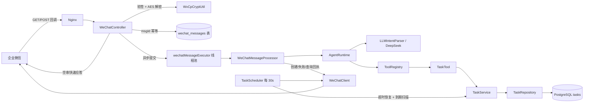

# ReminderCat

ReminderCat 是面向企业微信场景的 AI 提醒助手后端。用户在企业微信里用自然语言创建提醒（例如"明天下午3点提醒我开会"），系统通过 LLM 解析意图、写入 PostgreSQL，并在到达提醒时间后通过企业微信主动推送，同时把处理结果回执给用户。

项目已跑通完整主链路并真实验收（手机端真实收到定时提醒），并完成 P0 收尾：凭据外置、消息去重、异步回执、发送重试与超时恢复，可直接构建、测试和部署。

## 架构图



## 技术栈

- Java 21、Spring Boot 4.0.x、Maven
- Spring MVC、Jakarta Validation、Lombok
- MyBatis / MyBatis-Plus + PostgreSQL
- 企业微信 SDK `weixin-java-cp 4.7.0`（AES 加解密、签名校验）
- DeepSeek Chat API（LLM 意图解析）
- Docker / docker-compose（Nginx + 阿里云 ECS 已真实验收）

## 核心链路

### 1. 企业微信链路

- `GET /wechat/message`：URL 验证。验签通过后解密 `echostr` 返回，完成回调地址配置。
- `POST /wechat/message`：验签 + AES 解密 → 按 `msgId` 幂等登记（重复回调直接忽略）→ 立即返回空串（企业微信 5 秒应答时限内不触发重试）→ 提交异步线程池处理。
- 回执通过 `WeChatClient` 主动推送给用户：创建成功 / 创建失败 / 查询结果 / 无法识别意图。
- 全部凭据（corp-id、secret、agent-id、token、encoding-aes-key）来自环境变量，代码中零硬编码。

### 2. Agent 链路

`WeChatMessageProcessor` → `AgentRuntime`（意图解析 → 工具注册表 → 工具执行）→ 组装回执文本。

- 支持意图：`CREATE_TASK`（创建提醒）、`QUERY_TASK`（查询提醒）、`UNKNOWN`（未识别）。
- 意图解析：`LLMIntentParser` 调用 DeepSeek，要求返回结构化 JSON（intent / content / remindTime）。
- 回执示例：
  - 创建成功：`已创建提醒 ✅ 内容：开会 时间：2026-08-14 15:00`
  - 创建失败：`提醒创建失败：remindTime不能为空`
  - 查询：`你共有 2 条提醒：1. [08-14 15:00] 开会（待提醒）…`
  - 未知意图：引导用户使用"创建 / 查询"。

### 3. Scheduler 链路

`TaskScheduler` 每 30 秒扫描一次：

1. 先执行超时恢复：`PROCESSING` 超过 5 分钟未完成的任务恢复为 `PENDING`（进程崩溃、发送超时兜底）。
2. 查询到期任务：`PENDING` 且 `remind_time <= now`，且满足 `next_retry_time` 退避条件（每次最多 100 条）。
3. 原子抢占：`PENDING → PROCESSING`，`retry_count + 1`，避免多实例重复发送。
4. 发送成功 → `COMPLETED`（记录 `completed_time`）；发送失败 → 未达上限（默认 3 次）按 60s / 120s / 240s 退避重试，达上限 → `FAILED`，避免无限重发。

可用 `remindercat.scheduler.enabled=false` 关闭定时任务（测试、或运行多实例时只保留一个调度者）。

## 本地运行

前置要求：JDK 21、Maven 3.9+、PostgreSQL（或直接使用项目自带 docker-compose 的 postgres）。

```bash
# 1. 准备配置
cp .env.example .env   # 填入真实 DB / DeepSeek / 企业微信配置

# 2. 启动数据库（可选，使用 docker-compose 的 postgres，宿主端口 5433）
docker compose up -d postgres

# 3. 本地运行（默认连 localhost:5432，可用 DB_URL 覆盖）
export DB_URL=jdbc:postgresql://localhost:5433/remindercat
export DB_USERNAME=postgres
export DB_PASSWORD=your-password
./mvnw spring-boot:run
```

Windows PowerShell：

```powershell
$env:DB_URL='jdbc:postgresql://localhost:5433/remindercat'
$env:DB_USERNAME='postgres'
$env:DB_PASSWORD='your-password'
.\mvnw.cmd spring-boot:run
```

运行测试（需要可用的 PostgreSQL，通过 `DB_URL` 等环境变量指向测试库）：

```bash
mvn clean test
```

数据库表结构由 `src/main/resources/schema.sql` 幂等初始化（启动自动执行）；已部署的旧库也可手动执行 `src/main/resources/db/migration-v2.sql`。

## Docker 部署

```bash
docker compose up -d --build
```

- `backend`：应用镜像（多阶段构建），`postgres`：PostgreSQL 17。
- 环境变量由 `.env` 注入，`DB_PASSWORD` 为必填。
- Nginx 负责公网 HTTPS 反代到 8080；企业微信回调地址必须是公网可访问的 HTTPS 域名。
- 健康检查：`GET /health`，返回 `{"status":"UP","service":"ReminderCat"}`。

## 环境变量

| 变量 | 说明 | 默认值 |
| --- | --- | --- |
| `DB_URL` | JDBC 连接串 | `jdbc:postgresql://localhost:5432/remindercat` |
| `DB_USERNAME` | 数据库用户 | `postgres` |
| `DB_PASSWORD` | 数据库密码 | 空（docker-compose 必填） |
| `DEEPSEEK_API_KEY` | DeepSeek API Key | 空 |
| `DEEPSEEK_BASE_URL` | DeepSeek 接口地址 | `https://api.deepseek.com` |
| `DEEPSEEK_MODEL` | 模型名 | `deepseek-chat` |
| `WECHAT_CORP_ID` | 企业微信企业 ID | 空 |
| `WECHAT_SECRET` | 自建应用 Secret | 空 |
| `WECHAT_AGENT_ID` | 自建应用 AgentId | `0` |
| `WECHAT_TOKEN` | 回调 Token | 空 |
| `WECHAT_ENCODING_AES_KEY` | 回调 EncodingAESKey | 空 |
| `APP_PORT` | docker-compose 对外端口 | `8080` |

## 演示流程

1. 企业微信管理后台配置应用回调：URL `https://你的域名/wechat/message`，Token / EncodingAESKey 与 `.env` 一致。
2. 在企业微信中给应用发消息："明天下午3点提醒我开会" → 收到"已创建提醒 ✅…"。
3. 发送"查一下我的提醒" → 收到任务列表回执。
4. 到点自动收到"🔔 提醒喵：开会"（真实验收：手机端收到）。
5. 同一回调因网络重试重复推送时，`msgId` 幂等保证不会重复建任务。

## 当前能力

- 企业微信回调 URL 验证、文本接收、AES 解密与签名校验 ✅（真实验收）
- 自然语言创建提醒（DeepSeek 意图解析）✅（真实验收）
- PostgreSQL tasks 持久化、Scheduler 定时扫描、企业微信主动推送 ✅（真实验收）
- msgId 消息去重、回调快速应答 + 异步处理 ✅
- 用户回执：创建成功 / 失败 / 查询列表 ✅
- 发送重试：最多 3 次、60/120/240s 退避、`PROCESSING` 超时恢复 ✅
- Docker + Nginx + 阿里云 ECS 部署 ✅（真实验收）
- REST 管理/调试接口：`POST /api/tasks`、`GET /api/tasks/{userId}`、`PUT /api/tasks/{id}/complete`
- 遗留演示接口：`POST /api/message`（返回固定文案，未接入 Agent 链路，仅作参考）

## 数据库结构

`tasks`：`id`、`user_id`、`content`、`remind_time`、`status`（PENDING / PROCESSING / COMPLETED / FAILED）、`created_time`、`retry_count`、`next_retry_time`、`completed_time`、`updated_time`。

`wechat_messages`：`msg_id`（主键，幂等）、`user_id`、`msg_type`、`received_time`。

## 后续规划

- 任务取消 / 修改、待办状态过滤与分页、完成任务对话化、进度统计接口
- 管理后台 Web UI、监控告警（actuator / 结构化日志）
- Redis 会话 / 去重 / 分布式锁，多实例部署
- 重复规则（每天 / 每周）、多通知渠道
